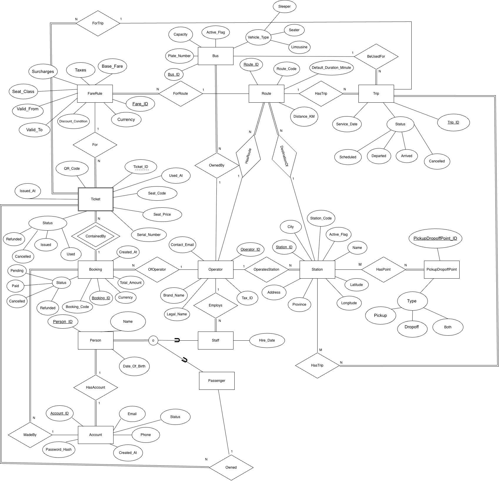

# VietBus Database Documentation

This document provides an overview of all stored procedures, functions, triggers, and events implemented in the VietBus booking system database that are actively used by the backend application.

---

## Table of Contents
- [Entity Relationship Diagram](#entity-relationship-diagram)
- [Stored Procedures](#stored-procedures)
- [Functions](#functions)
- [Triggers](#triggers)
- [Events](#events)

---

## Entity Relationship Diagram

The following diagram illustrates the database schema and relationships between all entities in the VietBus system:

### Key Relationships

- **Account → Person**: One-to-one relationship (each account has one person record)
- **Person → Passenger/Staff**: One-to-one specialization (person is either passenger or staff)
- **Operator → Station/Staff/Routes**: One-to-many (operator manages multiple entities)
- **Route → Trip**: One-to-many (route can have multiple scheduled trips)
- **Trip → Ticket**: One-to-many (trip can have multiple tickets)
- **Booking → Ticket**: One-to-many (booking can contain multiple tickets)
- **Bus → Trip**: One-to-many (bus can be assigned to multiple trips)
- **Fare → Route**: Many-to-one (multiple fare rules can apply to one route)

---

## Stored Procedures

### Account Management

| Procedure Name | Input Parameters | Output Parameters | Purpose |
|----------------|------------------|-------------------|---------|
| `sp_create_passenger_account` | `p_name` (VARCHAR), `p_dob` (DATE), `p_gov_id` (VARCHAR), `p_email` (VARCHAR), `p_phone` (VARCHAR) | `o_passenger_id` (INT) | Creates a complete passenger account with account, person, and passenger records. Validates email/phone uniqueness. Used during customer registration. |
| `sp_create_staff_account` | `p_name` (VARCHAR), `p_dob` (DATE), `p_gov_id` (VARCHAR), `p_email` (VARCHAR), `p_phone` (VARCHAR), `p_hire_date` (DATE), `p_operator_id` (VARCHAR) | `o_staff_id` (INT) | Creates a complete staff account with account, person, and staff records. Validates operator existence and email/phone uniqueness. Used during staff onboarding. |

### Trip Management

| Procedure Name | Input Parameters | Output Parameters | Purpose |
|----------------|------------------|-------------------|---------|
| `sp_schedule_trip` | `p_service_date` (DATETIME), `p_bus_id` (INT), `p_route_id` (INT) | `o_trip_id` (INT) | Schedules a new trip by validating bus availability (must be 'Active'), route existence, and creating the trip record with 'Scheduled' status. Used by admin to create new trips. |

### Booking & Ticketing

| Procedure Name | Input Parameters | Output Parameters | Purpose |
|----------------|------------------|-------------------|---------|
| `sp_create_booking_with_tickets` | `p_currency` (VARCHAR), `p_account_id` (INT), `p_operator_id` (VARCHAR), `p_trip_id` (INT), `p_fare_id` (INT), `p_seat_list` (JSON), `p_qr_code_link` (VARCHAR) | `o_booking_id` (INT) | Creates a booking and multiple tickets in a single transaction. Validates seat availability using `fn_get_available_seats`, checks seat conflicts, validates fare-route matching, and calculates total amount using `fn_calculate_booking_total`. Used during ticket purchase. |

---

## Functions

| Function Name | Input Parameters | Return Type | Purpose |
|---------------|------------------|-------------|---------|
| `fn_get_available_seats` | `p_trip_id` (INT) | INT | Calculates the number of available seats for a trip by subtracting booked/used seats from total bus capacity. Only counts tickets with status 'Used' or 'Issued'. Used extensively in trip listings and booking validation. |
| `fn_calculate_booking_total` | `p_booking_id` (INT) | INT | Calculates the total amount for a booking by summing all ticket prices, excluding cancelled or refunded tickets. Used to update booking totals after ticket modifications. |

---

## Triggers

### Auto-Generated Values

| Trigger Name | Event | Table | Purpose |
|--------------|-------|-------|---------|
| `trg_operator_before_insert` | BEFORE INSERT | `operator` | Auto-generates sequential operator IDs with format 'OP001', 'OP002', etc. Finds the highest existing number and increments by 1. |
| `trg_ticket_before_insert_generate_serial` | BEFORE INSERT | `ticket` | Generates a random 8-digit serial number (10000000-99999999) for each ticket. Used for ticket identification and verification. |

### Business Rule Enforcement

| Trigger Name | Event | Table | Purpose |
|--------------|-------|-------|---------|
| `trg_trip_before_update_check_tickets` | BEFORE UPDATE | `trip` | Prevents trip cancellation if there are active (issued) tickets. Ensures business rule that tickets must be refunded or rebooked before cancelling a trip. Throws error if violation detected. |

### Derived Column Updates

| Trigger Name | Event | Table | Purpose |
|--------------|-------|-------|---------|
| `trg_trip_before_insert_set_arrival` | BEFORE INSERT | `trip` | Automatically calculates and sets the `arrival_datetime` by adding the route's default duration to the service date. Ensures consistent arrival time prediction. |
| `trg_trip_before_update_set_arrival` | BEFORE UPDATE | `trip` | Recalculates `arrival_datetime` when `service_date` or `route_id` changes. Maintains accurate arrival time estimates when trip details are modified. |

---

## Events

| Event Name | Schedule | Purpose |
|------------|----------|---------|
| `ev_auto_update_trip_status` | Every 1 minute | Automatically updates trip status based on current time:  - `Scheduled`: NOW() < service_date  - `Departed`: service_date ≤ NOW() < arrival_datetime  - `Arrived`: NOW() ≥ arrival_datetime  Does not affect 'Cancelled' trips. Keeps trip status synchronized with real-time without manual intervention. |

---

## Usage Notes

### Backend Integration
All stored procedures, functions, triggers, and events listed above are actively used by the Flask backend application:

- **Authentication Routes** (`auth.py`): Uses `sp_create_passenger_account` and `sp_create_staff_account`
- **Booking Routes** (`booking.py`): Uses `sp_create_booking_with_tickets`
- **Trip Routes** (`trips.py`): Uses `sp_schedule_trip` and `fn_get_available_seats`
- **Schedule Routes** (`schedule.py`): Uses `fn_get_available_seats` and `fn_calculate_booking_total`
- **Admin Routes** (`admin.py`): Uses various procedures for management operations

### Transaction Safety
All multi-step procedures use `START TRANSACTION` and `COMMIT` to ensure data consistency. Errors trigger automatic rollback through MySQL's transaction handling.

### Error Handling
Procedures use `SIGNAL SQLSTATE '45000'` to throw custom errors with descriptive messages when:
- Required records don't exist
- Business rules are violated
- Data conflicts are detected
- Invalid input is provided

These errors are caught and handled by the backend application's error handling middleware.

---

## Database Schema Version
Last Updated: January 31, 2026
